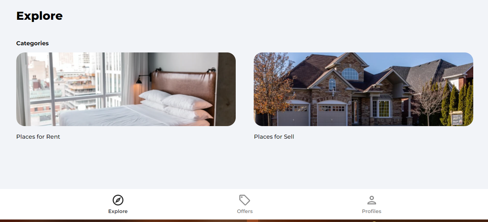

# Magicbrick Clone

I've developed reactapp for house market for sell and rent with help of firerbase as database & for login/registering.  
#### This application is not working fully except login/registering (with google as well).
 #### Main issue is adding new houses and address is not coming from google map's api. I'll do another version in future without it. 
Please check out below screenshots for better understanding.

## Screenshots

- Home

- Expanded Tab

- Profile

- Offers

- Sign In

- Register Mobile

- Error

### Technologies used :

 - React
 - HTML/CSS
 - Context API (part of React)
 - Firebase
 - Firestore
